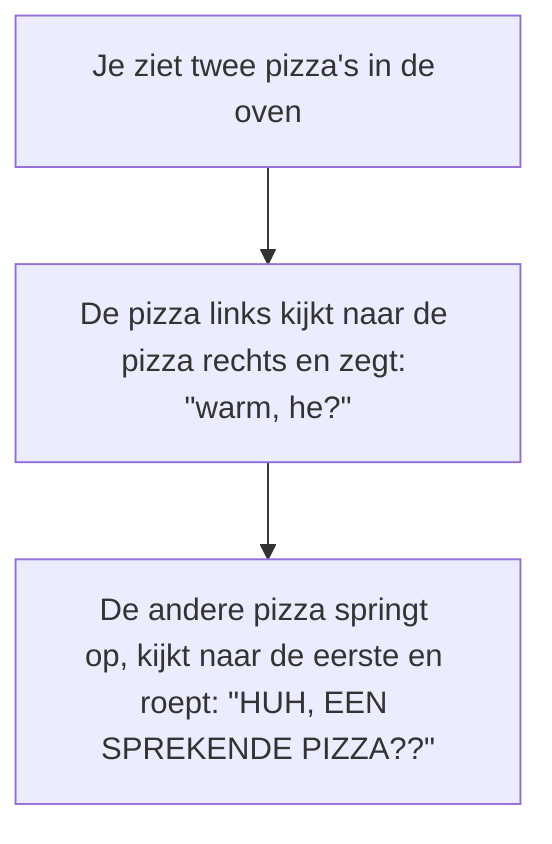

# 💻 PROJECT: SD2 - Digital Comicbook

- [💻 PROJECT: SD2 - Digital Comicbook](#-project-sd2---digital-comicbook)
  - [🥅 Overzicht en Leerdoelen](#-overzicht-en-leerdoelen)
  - [🔍 Digital Comicbook](#-digital-comicbook)
  - [🛠️ Opdrachten](#️-opdrachten)
  - [💡 Belangrijke Termen](#-belangrijke-termen)
  - [📚 Bronnen](#-bronnen)
  - [🔒 **Minimale Vereisten**](#-minimale-vereisten)
  - [🏆 **Evaluatie**](#-evaluatie)
    - [Instructies](#instructies)
    - [Codeblokken](#codeblokken)
    - [Basiskennis](#basiskennis)

## 🥅 Overzicht en Leerdoelen

 - tijd: **8u**
 - start: **27 september**
 - einde: **17 oktober** (deadline)
 - onderwerp:
   - **Instructies**
   - **functies**
   - **commentaar**

Met dit project leer je aan de slag gaan met javascript en de p5.js library. Je leert sequenties, selecties, iteraties en functies toepassen.

## 🔍 Digital Comicbook

Samen met je leraar Informatica speel je het spel Superfight, waarin je zelf een superheld opbouwt en tegen de supervillains van andere spelers laat vechten. Tijdens deze opdracht ga je één van jouw Superheroes een eigen verhaal geven. Met behulp van Javascript ga je een stripverhaal tekenen met daarin een kort verhaal, sketch, (flauwe) mop, ... waarin jouw superheld de hoofdrol speelt.

Je gaat minstens 5 **stripkaders** tekenen, die één voor één met behulp van de knoppen `vorige` en `volgende` worden getoond.

> 

> 
 <em>Wat is een <strong>stripkader</strong>?</em> 

>
> stripkader - Basiseenheden waaruit een stripverhaal bestaat. Ze worden vaak sequentieel gepresenteerd, waarbij elk kader een moment in het verhaal weergeeft. Kaders worden soms ook in tabelvorm gepresenteerd, en hebben verschillende groottes om de visuele monotonie te doorbreken en te variëren in de narratieve nadruk.
>
> 

 

Dit project bestaat uit verschillende opdrachten. Je maakt de opdrachten in de juiste volgorde. Lees elke opdracht goed voor je er aan begint.

Het is belangrijk dat je hier regelmatig aan werkt. Je toont dit door regelmatig een nieuwe update te pushen naar github.
TIP: Commit en Push elke keer je je laptop sluit. Zo voorkom je dat je je werk kwijt geraakt.

## 🛠️ Opdrachten

Theorie: Vul de definities en termen in

> - [ ] Vul onderaan dit document een definitie in voor elke term. De 3 vraagtekens mag je verwijderen.
>   - Gebruik de cursus om een goede defnitie te vinden.

---

opdracht 1: Maak een flowchart van je verhaal

> - [ ] Schrijf je verhaal uit in flowchart vorm.

⚠️ Jouw verhaal bestaat uit **minstens 5 stripkaders**. Hierboven is slechts een kort voorbeeld!

---

opdracht 2: Teken het eerste stripkader

> - [ ] Gebruik de tekenfuncties van p5.js om het eerste stripkader te tekenen.
> - [ ] Geef je kader een achtergrondkleur en rand.
> - [ ] Geef elke figuur (superheld, boom, wolk, ...) een aparte functie. Gebruik die functies om je figuren te tekenen.

---

opdracht 3: Parameteriseer overeenkomstige elementen

> - [ ] Kijk na welke figuren je nog wilt herbruiken in andere stripkaders.  
>   (bv. een boom die je ergens anders ook wilt tonen)
> - [ ] Voorzie de functie van die figuur van de juiste parameters, zodat je de figuur kunt herbruiken.  
>   (bv. een x en y waarde als je de boom op een andere plek in een stripkader wilt kunnen tekenen)

---

opdracht 4: Teken alle volgende stripkaders

> - [ ] Gebruik de tekenfuncties van p5.js om de volgende stripkaders te tekenen.
> - [ ] Geef elke kader een achtergrondkleur en rand.
> - [ ] Geef elke figuur (superheld, boom, wolk, ...) een aparte functie. Gebruik die functies om je figuren te tekenen.
> - [ ] Kijk na welke figuren je nog wilt herbruiken in andere stripkaders.  
>   (bv. een boom die je ergens anders ook wilt tonen)
> - [ ] Voorzie de functie van die figuur van de juiste parameters, zodat je de figuur kunt herbruiken.  
>   (bv. een x en y waarde als je de boom op een andere plek in een stripkader wilt kunnen tekenen)

---

## 💡 Belangrijke Termen

| Term                  | Definitie |
| --------------------- | --------- |
| waarde                | ???       |
| datatype              | ???       |
| variabele             | ???       |
| declaratie            | ???       |
| initialiseren         | ???       |
| array                 | ???       |
| index                 | ???       |
| indexed array         | ???       |
| associative array     | ???       |
| expressie             | ???       |
| rekenkundige operatie | ???       |
| logische operatie     | ???       |
| operatie              | ???       |
| voorwaarde            | ???       |
| operator              | ???       |
| instructie            | ???       |
| toewijzing            | ???       |
| commentaar            | ???       |
| codeblok              | ???       |
| functie               | ???       |
| signature             | ???       |
| return value          | ???       |
| parameter             | ???       |

## 📚 Bronnen

 - [cursus instructies](https://t-informatica.github.io/courses/programmeren/instructies/)
 - [cursus codeblokken](https://t-informatica.github.io/courses/programmeren/codeblokken/)
 - [p5.js](https://p5js.org/)
 - [W3Schools](https://www.w3schools.com/js/default.asp)
 - [Khan Academy](https://www.khanacademy.org/computing/computer-programming/programming#intro-to-programming)

---

## 🔒 **Minimale Vereisten**

*Dit zijn de minimale eisen van het project. Voldoe je hier niet aan, krijg je een E.*

 - [ ] Je verhaal bestaat uit minstens 5 stripkaders.
 - [ ] Je verhaal bevat minstens 2 verschillende soorten tekstballonnen.
 - [ ] Je flowchart is gemaakt met [Markdown (Mermaid)](https://mermaid-js.github.io/mermaid/#/flowchart).
 - [ ] Je code maakt gebruik van de p5.js library voor [tekenfuncties](https://p5js.org/reference/#Shape2D%20Primitives).
 - [ ] Al je figuren zijn getekend met p5.js tekenfuncties, je maakt in dit project geen gebruik van afbeeldingen.

## 🏆 **Evaluatie**

### Instructies

| A                                                                                                                                                     | B                                                                                                                                                                                                                                | C                                                                                                                                                                                                                                         | D                                                                                                                                                                                                                             | E                                                                                                                                             |
| ----------------------------------------------------------------------------------------------------------------------------------------------------- | -------------------------------------------------------------------------------------------------------------------------------------------------------------------------------------------------------------------------------- | ----------------------------------------------------------------------------------------------------------------------------------------------------------------------------------------------------------------------------------------- | ----------------------------------------------------------------------------------------------------------------------------------------------------------------------------------------------------------------------------- | --------------------------------------------------------------------------------------------------------------------------------------------- |
| Data wordt correct bewaard en bewerkt met behulp van variabelen en de juiste operators. De volgorde van instructies en operaties wordt gerespecteerd. | Data wordt correct bewaard en bewerkt met behulp van variabelen en de juiste operators. De volgorde van instructies en operaties wordt gerespecteerd. Er zijn echter betere oplossingen die je had kunnen bedenken en gebruiken. | Data wordt correct bewerkt met behulp van de juiste operators. Het bewaren van data kan voor problemen zorgen, omdat je variabelen niet correct gebruikt of initialiseert, of omdat de volgorde van instructies niet wordt gerespecteerd. | Data wordt correct bewaard met behulp van variabelen. Het bewerken van data kan voor problemen zorgen, omdat je de verschillende operators niet correct hanteert of omdat de volgorde van operators niet wordt gerespecteerd. | Je maakt onvoldoende gebruik van variabelen en operators om data op correcte wijze te bewaren en bewerken.                                    |
| Namen van variabelen zijn duidelijk. Code wordt verduidelijkt met leesbare commentaar. Data wordt opgeslagen met behulp van het juiste datatype.      | Namen van variabelen zijn duidelijk. Code wordt verduidelijkt met commentaar. Je commentaar is echter onvoldoende duidelijk. Data wordt opgeslagen met behulp van het juiste datatype.                                           | Namen van variabelen zijn duidelijk. Code wordt verduidelijkt met commentaar. Bij het opslaan van data kies je voor het verkeerde datatype.                                                                                               | Code wordt verduidelijkt met commentaar. Data wordt opgeslagen met behulp van het juiste datatype. De namen van variabelen zijn onvoldoende duidelijk.                                                                        | Namen van variabelen zijn onvoldoende duidelijk. Je commentaar is onvoldoende uitgewerkt. Data wordt opgeslagen onder het verkeerde datatype. |

### Codeblokken

| A                                                                                                                                                                    | B                                                                                                                                                                                                                                               | C                                                                                                                                                                                                               | D                                                                                                                                                                                                                                          | E                                                                                                                                                                                    |
| -------------------------------------------------------------------------------------------------------------------------------------------------------------------- | ----------------------------------------------------------------------------------------------------------------------------------------------------------------------------------------------------------------------------------------------- | --------------------------------------------------------------------------------------------------------------------------------------------------------------------------------------------------------------- | ------------------------------------------------------------------------------------------------------------------------------------------------------------------------------------------------------------------------------------------ | ------------------------------------------------------------------------------------------------------------------------------------------------------------------------------------ |
| De scope van codeblokken wordt gerespecteerd. Lokale variabelen en parameters worden gebruikt waar nodig. Het D.R.Y. principe wordt zo goed mogelijk toegepast.      | De scope van codeblokken wordt gerespecteerd, doordat lokale variabelen en parameters worden gebruikt waar nodig. Het D.R.Y. principe wordt correct toegepast. Er zijn echter betere oplossingen die je had kunnen bedenken en gebruiken.       | De scope van codeblokken wordt gerespecteerd, doordat lokale variabelen en parameters worden gebruikt waar nodig. Er zijn echter duidelijke voorbeelden waarbij het D.R.Y. principe onvoldoende werd toegepast. | Het D.R.Y. principe wordt correct toegepast. De scope van codeblokken wordt echter niet altijd gerespecteerd, doordat lokale variabelen en parameters niet of verkeerd worden gebruikt.                                                    | Je gebruikt geen codeblokken waar nodig, waardoor het D.R.Y. principe niet correct wordt toegepast en de scope van codeblokken ovoldoende wordt gerespecteerd.                       |
| Functies beperken zich tot één duidelijk doel. De namen van functies en parameters zijn duidelijk gekozen. Functies worden vooraf gegaan door duidelijke commentaar. | Functies beperken zich tot één duidelijk doel. De namen van functies en parameters zijn duidelijk gekozen. Functies worden vooraf gegaan door duidelijke commentaar. Er zijn echter betere oplossingen die je had kunnen bedenken en gebruiken. | Functies beperken zich tot één duidelijk doel. De namen van functies en parameters zijn duidelijk gekozen. Functiecommentaar is onvoldoende uitgewerkt en draagt weinig bij.                                    | De namen van functies en parameters zijn duidelijk gekozen. Functies worden vooraf gegaan door duidelijke commentaar. Functies worden echter niet beperkt tot één duidelijk doel, waardoor functies groter of complexer zijn dan nodig is. | Functies zijn onvoldoende uitgewerkt, of hebben geen duidelijk doel. De namen van functies en parameters zijn niet voldoende duidelijk. Functiecommentaar is onvoldoende uitgewerkt. |

### Basiskennis

| A                                                                                                                                                                                                                                                                        | B                                                                                                                                                                                                            | C                                                                                                                                                                                                                        | D                                                                                                                                                                                                                        | E                                                                                                                                  |
| ------------------------------------------------------------------------------------------------------------------------------------------------------------------------------------------------------------------------------------------------------------------------ | ------------------------------------------------------------------------------------------------------------------------------------------------------------------------------------------------------------ | ------------------------------------------------------------------------------------------------------------------------------------------------------------------------------------------------------------------------ | ------------------------------------------------------------------------------------------------------------------------------------------------------------------------------------------------------------------------ | ---------------------------------------------------------------------------------------------------------------------------------- |
| De code is voorzien van duidelijke en uitgebreide commentaar. Bestanden zijn georganiseerd met behulp van een duidelijk naamgeving en mappenstructuur. Een Version Control System wordt regelmatig gebruikt met duidelijke commentaar om code-wijzigingen bij te houden. | De code is voorzien van duidelijke en uitgebreide commentaar. Bestanden zijn georganiseerd met behulp van een duidelijk naamgeving en mappenstructuur. Een Version Control System wordt regelmatig gebruikt. | De code is voorzien van duidelijke en uitgebreide commentaar. Bestanden zijn onvoldoende georganiseerd met behulp van een duidelijk naamgeving en mappenstructuur. Een Version Control System wordt regelmatig gebruikt. | De code is onvoldoende voorzien van duidelijke en uitgebreide commentaar. Bestanden zijn georganiseerd met behulp van een duidelijk naamgeving en mappenstructuur. Een Version Control System wordt regelmatig gebruikt. | De code is niet voorzien van commentaar. Bestanden zijn niet goed georganiseerd. Een Version Control System is te weinig gebruikt. |
