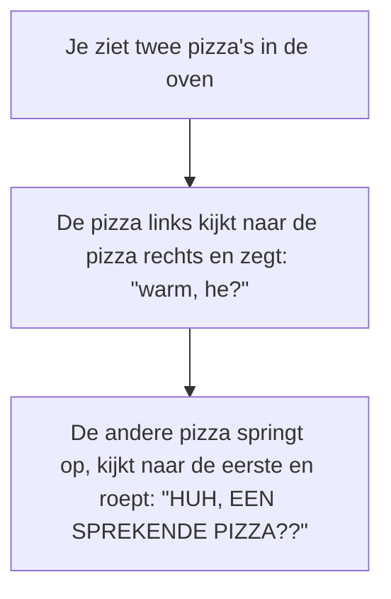

```mermaid
flowchart
   stripkader1["Je ziet twee pizza's in de oven"]
   stripkader2["De pizza links kijkt naar de pizza rechts en zegt: #quot;warm, he?#quot;"]
   stripkader3["De andere pizza springt op, kijkt naar de eerste en roept: #quot;HUH, EEN SPREKENDE PIZZA??#quot;"]
   
   stripkader1 --> stripkader2
   stripkader2 --> stripkader3
```